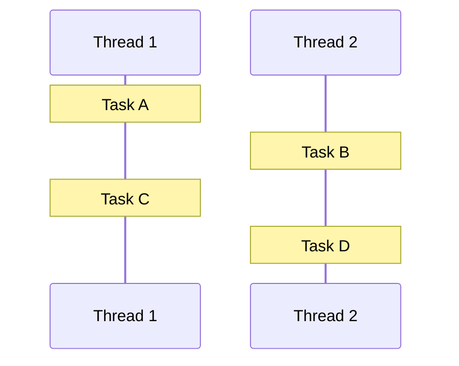
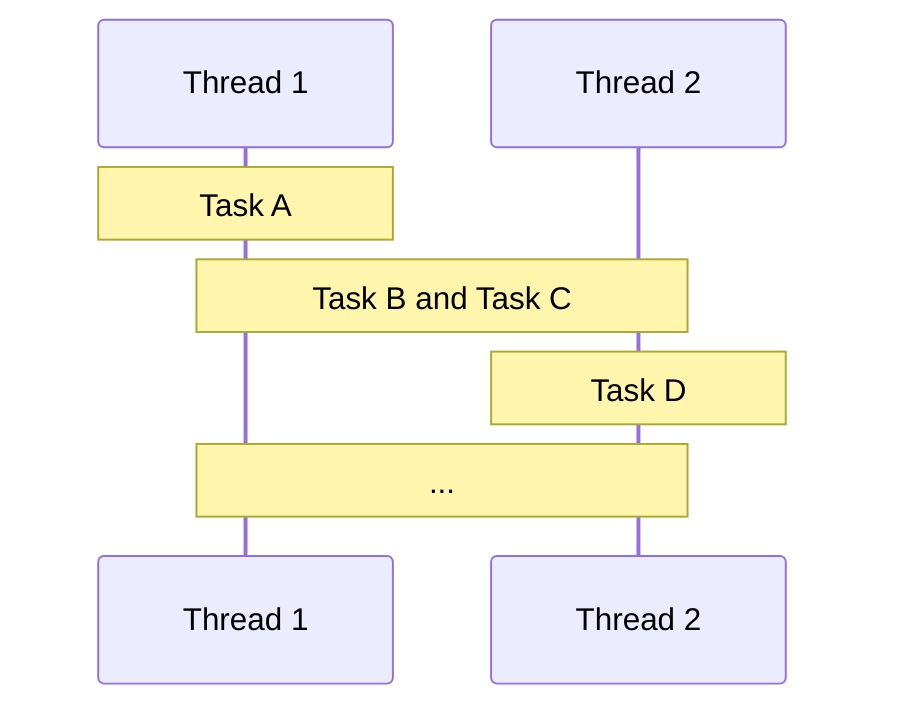
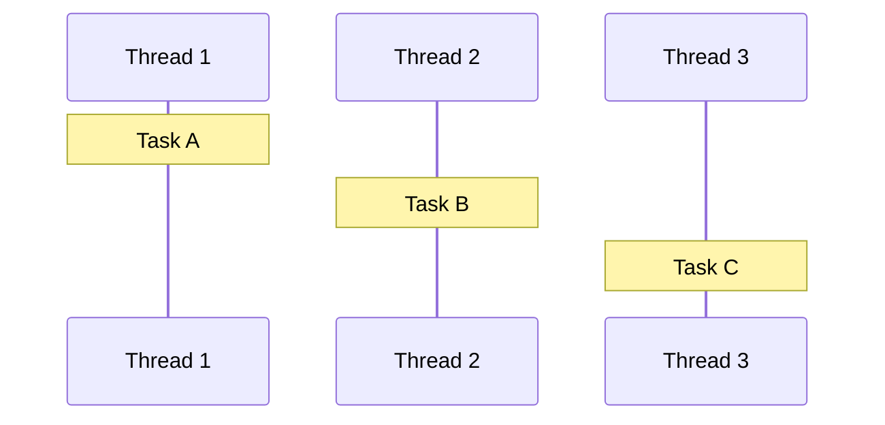
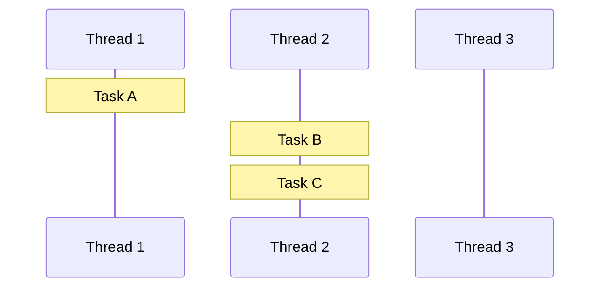
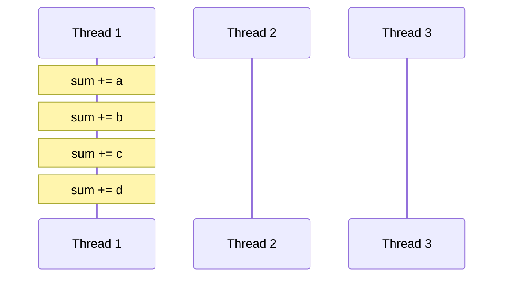
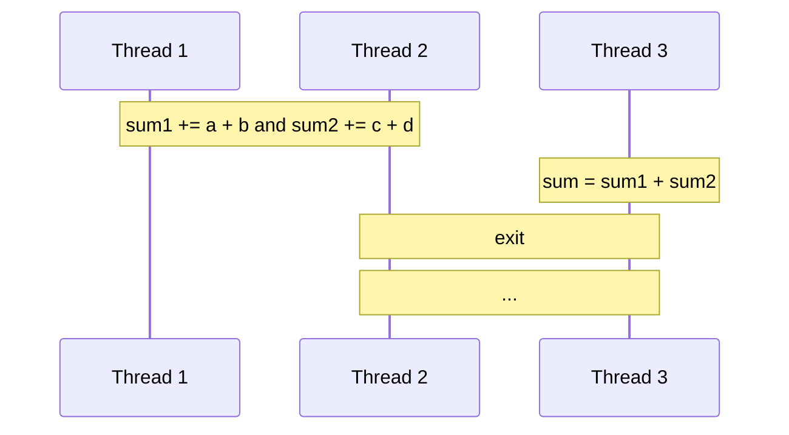
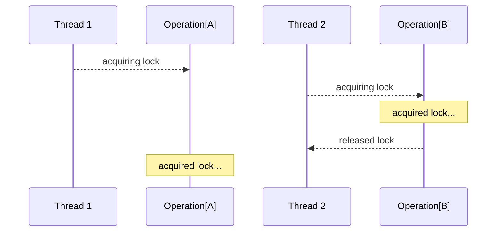

# Asynchornous and multithreaded programming

Intro to asynchornous and multithreaded programming using C++

<div class="pt-12">
    <span @click="$slidev.nav.next" class="py-1 rounded cursor-pointer" hover="bg-white bg-opacity-10">
        Get Started <carbon:arrow-right class="inline" />
    </span>
</div>


---

# Why we have this class?

Let's known what we're talking about

假设有一个正在运行的程序（Program），它接收实时的输入（Realtime Input），并且对应于每个输入，它产生实时的标准输出（Standard Output）。

现在请设想该程序的执行仅在拥有一个线程（Thread）的进程（Process）中完成，这意味着运行中的整个处理是同步（Synchronous）的。因此这个程序每接收一个输入，就需要处理它并产生一个标准输出。

上述设计的局限性在于，在处理完先前的输入之前，进程不能接受另外一个输入，如果处理一个输入的时间超过预期，那么在执行过程中新的输入就可能会被抛弃（Discard）或着是新的输入不能被及时处理。

---

# What is threads?

Introduction to Linux threads concepts

- 线程（Thread）通常被认为是调度器工作的最小的处理单位。

- 一个进程（Process）可以有多个执行线程，这些线程可以是异步执行的。

- 创建一个线程或终止一个线程是由操作系统完成的，这需要消耗 CPU 资源。

- 在系统中各个线程往往是异步（Asynchronous）执行的，这种异步执行为线程带来了独立处理一个特定工作或服务的能力。因此，在一个进程中运行的多个线程处理它们的事务，总体上构成了进程的完整能力。

---

# What is synchronous programming?

Let's understand what is synchronous programming

- 在同步执行模型（Synchronous Model）中，程序被分配任务（Task），并开始执行命令。

- 当任务完成后，程序就会接受下一个任务，并做同样的事情：它一个接一个地执行所有的命令，以完成一个完整的任务。

- 在这样的模式中，正在执行命令的程序不能半途而废去接受下一个任务。

---

# What is asynchronous programming?

Asynchronous is the opposite of synchronous, reprenting the concurrency execution of multiple tasks

- 在异步执行模型（Asynchronous Model）中，程序的执行是相对主程序（Main Thread）流程独立的。

- 当程序异步执行命令处理任务时，主线程往往有非阻塞的 I/O，这样一个任务就可以与其他任务同时（Simultaneously）执行。

- 在这样的模式中，一个程序可以放弃正在处理的任务，转到下一个任务。

---

# Understand concurrency and parallelism

Concurrency and parallelism are two different things, but they're both based threads

- 并发性（Concurrency）

  并发是指在相同的时间段内有多个任务被处理。一个重要的细节是，任务不一定在同一时间执行。这是基于可中断性（Interruptability）的概念，即任务可以被划分为更小的、交替的子任务。在这种情况下，它们可以同时执行，但这并不是必须的。

- 并行性（Parallelism）

  并行性从字面上看就是任务的同时执行。这个名字本身就意味着它们是平行执行的。并行性是实现并发执行的方法之一，突出了线程或进程的抽象性。此外，要想实现并行，必须在物理结构上提供至少两个 CPU 计算资源。

---
title: Concurrency and Parallelism
layout: two-cols
---

# Synchrony

Only one task executing allowed at the same time



::right::

# Asynchrony

Multiple tasks executing allowed at the same time



---

# Asynchronous programming example

Let's understand how to write code asynchrony

这里我们声明一个函数来计算一个整数的平方。

```cpp
auto slow_sqr(const int value) {
    std::this_thread::sleep_for(500ms);
    return value * value;
}
```

一般来说，异步函数比这更复杂，往往是网络请求或文件系统调用，这些场景总是有一个很长的执行时间。为了简单起见，这个例子中的函数只是计算一个有 `500ms` 延迟的平方数。

---
title: The slow square execution flow
---

然后，假设我们有 3 个任务来计算某个整数的平方，并将其输出到控制台（Console），通常你可能会写出这样的代码。

```cpp
{
    auto result1 = slow_sqr(2);  // Task 1
    auto result2 = slow_sqr(4);  // Task 2
    auto result3 = slow_sqr(8);  // Task 3
    std::printf("results -> %d, %d, %d\n", result1, result2, result3);
}
```

如你所见，这些任务的执行时间可能超过 `1500ms`，因为它们的执行顺序是按字面意思排列的，执行下一个任务必须等待前一个任务完成。

---
title: The asynchronous slow square execution flow
---

让我们以异步的方式编写我们的 `slow_sqr`，这样下一个任务就不需要等待之前的任务来执行。

```cpp
{
    auto result1 = async_sqr_ftr(slow_sqr, 2);  // Task 1
    auto result2 = async_sqr_ftr(slow_sqr, 4);  // Task 2
    auto result3 = async_sqr_ftr(slow_sqr, 8);  // Task 3
    std::printf("results -> %d, %d, %d\n", result1.get(), result2.get(), result3.get());
}
```

函数 `async_sqr_ftr` 是一个包装函数，它一旦执行就立即返回一个 future 对象并在后台继续执行，这个对象是存放异步函数结果的容器，`get()` 函数用于在 future 对象准备好时获取其结果。

---
title: The asynchronous slow square
---

让我们了解一下 `async_sqr_ftr()` 函数如何工作，参考如下代码：

```cpp
std::future<int> async_sqr_ftr(const int value) {
    std::promise<int> pms;
    std::future<int> ftr { pms.get_future() };
    std::thread thr([p = std::move(pms), v = value]() mutable {
        p.set_value(slow_sqr(v));
    });
    thr.detach();
    return ftr;
}
```

---
title: The asynchronous slow square
---

C++ 标准库为我们提供了一种叫做 `std::future` 的类型（Type）。这个 future 包含一个异步操作的结果，它一般与相应的 `std::promise` 相关联。


```cpp {2,3}
std::future<int> async_sqr_ftr(const int value) {
    std::promise<int> pms;
    std::future<int> ftr { pms.get_future() };
    std::thread thr([p = std::move(pms), v = value]() mutable {
        p.set_value(slow_sqr(v));
    });
    thr.detach();
    return ftr;
}
```

---
title: The asynchronous slow square
---

为了避免调用者被阻塞，我们开了一个新的线程来进行计算。请注意，这里的承诺被转移（Move）到新的线程中，而不是通过直接引用（Reference）来捕获（Capture）。否则，由于 RAII（Resource Acquisition Is Initialization），`pms` 将在执行 `return` 后被销毁。

```cpp {4,8}
std::future<int> async_sqr_ftr(const int value) {
    std::promise<int> pms;
    std::future<int> ftr { pms.get_future() };
    std::thread thr([p = std::move(pms), v = value]() mutable {
        p.set_value(slow_sqr(v));
    });
    thr.detach();
    return ftr;
}
```

---
title: The asynchronous slow square
---

在创建完线程后，我们将线程分离（Detach）出来，该线程将在后台运行，直到里面的任务完成。我们立即返回创建好的 future 对象，以便调用者可以继续做其他任务。

```cpp {7,8}
std::future<int> async_sqr_ftr(const int value) {
    std::promise<int> pms;
    std::future<int> ftr { pms.get_future() };
    std::thread thr([p = std::move(pms), v = value]() mutable {
        p.set_value(slow_sqr(v));
    });
    thr.detach();
    return ftr;
}
```

---
title: The asynchronous slow square
---

计算完成后，可以调用 promise 的 `set_value()` 方法（Method）来设置这个返回值，而相应的 `future::get()` 方法可以阻塞（Congest）当前线程，直到相应的 promise 返回该值。

```cpp {5}
std::future<int> async_sqr_ftr(const int value) {
    std::promise<int> pms;
    std::future<int> ftr { pms.get_future() };
    std::thread thr([p = std::move(pms), v = value]() mutable {
        p.set_value(slow_sqr(v));
    });
    thr.detach();
    return ftr;
}
```

---

# The `std::async`

Asynchronous programming example using `std::async`

实际上，上面的代码是 `std::async` 的一个小部分实现，因此我们可以直接使用后者。

```cpp
{
    auto result1 = std::async(slow_sqr, 2);  // Task 1
    auto result2 = std::async(slow_sqr, 4);  // Task 2
    auto result3 = std::async(slow_sqr, 8);  // Task 3
    std::printf("results -> %d, %d, %d\n", result1.get(), result2.get(), result3.get());
}
```

当调用 `std::async` 时，它将返回一个 `std::future`。然后使用 future 的方法 `get()` 来获取每个任务的结果。`get()` 方法将等待直到它有一个有效的结果，如果任务已经有一个，`get()` 方法将立即返回，否则将等待，直到它有一个。

---

# What is `std::async` and how to use it?

It is a function template that accepts callbacks (functions or function objects) as arguments and has the possibility to execute them asynchronously

```cpp
template<class Function, class... Args>
std::future<std::result_of_t<std::decay_t<Function>(std::decay_t<Args>...)>>
async(Function&& f, Args&&... args);

template< class Function, class... Args >
std::future<std::invoke_result_t<std::decay_t<Function>, std::decay_t<Args>...>>
async(std::launch policy, Function&& f, Args&&... args);
```

---
title: The launch policy
---

让我们了解一下 `std::launch` 策略（Policy），它是 2 个比特掩码值（Bitmask），每个比特控制异步执行的方式（Execution Methods）。


| Bitmask                   | Description             |
|---------------------------|-------------------------|
| `std::launch::async`      | asynchronous evaluation |
| `std::launch::deferred`   | lazy evaluation         |

---
title: Understand the launch policy
layout: two-cols
---

# Asynchronous evaluation

Each task will obtain a new thread, and the thread will execute the task (only Linux)



::right::

# Lazy evaluation

The new task will continue in a thread that is already available, otherwise it will create a new thread



---

# When to use lazy evaluation?

Here's an example scenario of using lazy evaluation

我们知道，创建分配线程是很昂贵的，惰性求值（Lazy Evaluation）意味着同一线程的延续（Continuation），但执行的是不同的任务，所以如果任务是在相对短的时间段里连续产生的，我们更倾向于使用惰性求值。

例如，计算 $2^{2*2*2}=2^8$：

```cpp
void 🍉 (const int value = 2) {
    auto squared = std::async(std::launch::deferred, slow_sqr, value);
    auto fourth  = std::async(std::launch::deferred, slow_sqr, squared.get());
    auto result  = std::async(std::launch::deferred, slow_sqr, fourth.get());
    std::printf("result -> %d\n", result.get());
}
```
---

# What about the callback function?

How to use the callback functions instead of `std::async`

对于例子中这个简单的惰性求值场景，我们可以很容易地推断出，所有的计算都可以通过回调函数来完成，事实上并不需要 `std::async` 这种复杂庞大东西。

```cpp
void 🍉 (const int value = 2) {
    std::promise<void> pms;
    std::future<void> ftr = pms.get_future();
    async_sqr_cbk(value, [p = std::move(pms)](const int squared) mutable {
        async_sqr_cbk(squared, [p = std::move(p)](const int fourth) mutable {
            async_sqr_cbk(fourth, [p = std::move(p)](const int result) mutable {
                std::printf("result -> %d\n", result);
                p.set_value();
            });
        });
    });
    ftr.get();
}
```

---

# The callback function

What is the implementation of `async_sqr_cbk()`?

```cpp
template <std::invocable<int> F>
void async_sqr_cbk(const int value, F&& continuation) {
    std::thread thr([v = value, c = std::forward<F>(continuation)]() mutable {
        c(slow_sqr(v));
    });
    thr.detach();
}
```

正如我们之前谈到的，惰性求值意味着同一线程但不同任务的延续，所以如果任务是连续的，我们可以使用回调函数来重构这些任务的执行流程。

---
title: The implementation of `async_sqr_cbk()`
---

```cpp {3,5,6}
template <std::invocable<int> F>
void async_sqr_cbk(const int value, F&& continuation) {
    std::thread thr([v = value, c = std::forward<F>(continuation)]() mutable {
        c(slow_sqr(v));
    });
    thr.detach();
}
```

就像我们之前谈到的 `async_sqr_ftr()`，我们创建一个新的线程，然后将其分离，这样调用这个函数就不会阻塞调用线程。

---
title: The implementation of `async_sqr_cbk()`
---

```cpp {4}
template <std::invocable<int> F>
void async_sqr_cbk(const int value, F&& continuation) {
    std::thread thr([v = value, c = std::forward<F>(continuation)]() mutable {
        c(slow_sqr(v));
    });
    thr.detach();
}
```

我们在新的线程中进行计算，计算完成后，我们将结果作为参数传递给一个名为 `c` 的函数，作为它的延续。

---

# The coroutine

C++ 20 introduces coroutine that simplifies the use and implementation of asynchronous algorithms

如果我们使用协程（Coroutine），计算 $2^{2*2*2}=2^8$ 结果的代码将更容易阅读和维护。

```cpp
task 🍉 (const int value = 2) {
    auto squared = co_await slow_sqr_coro(value);
    auto fourth  = co_await slow_sqr_coro(squared);
    auto result  = co_await slow_sqr_coro(fourth);
    std::printf("result -> %d\n", result);
}
```

与普通函数不同，一个并发任务中可以有多个挂起点（Suspend Point）。挂起的任务将控制权传递给调用者，然后调用者可以再次恢复任务（Resume）的执行。被恢复的任务将从最后挂起的位置继续执行，直到下一次挂起，或者整个任务执行结束。

---

# Coroutine for slow square

Let's see the implementation of `slow_sqr_coro`

```cpp
struct slow_sqr_coro {
    explicit slow_sqr_coro(const int value) : m_value(value) {}
    bool await_ready() const noexcept { return false; }
    void await_suspend(const std::coroutine_handle<> awaiting) {
        async_sqr_cbk(m_value, [this, awaiting](const int result) {
            m_result = result;
            awaiting.resume();
        });
    }
    int await_resume() const noexcept { return m_result; }
    int m_value  { 0 };
    int m_result { 0 };
};
```

我们使用一个名为 `slow_sqr_coro` 的结构体以协程的方式来封装我们的任务框架，其成员函数名（Member Functions）称表示协程在不同状态下的执行流程。

---
title: The implementation of `slow_sqr_coro`
---

```cpp {2,11,12}
struct slow_sqr_coro {
    explicit slow_sqr_coro(const int value) : m_value(value) {}
    bool await_ready() const noexcept { return false; }
    void await_suspend(const std::coroutine_handle<> awaiting) {
        async_sqr_cbk(m_value, [this, awaiting](const int result) {
            m_result = result;
            awaiting.resume();
        });
    }
    int await_resume() const noexcept { return m_result; }
    int m_value  { 0 };
    int m_result { 0 };
};
```

首先，我们需要将参数存储在某个地方，最简单直接的方法是在初始化 `slow_sqr_coro` 时将其存储在一个成员变量（Member Variable）中，然后我们可以在进程挂起时将参数传递给回调函数。

---
title: The implementation of `slow_sqr_coro`
---

```cpp {3}
struct slow_sqr_coro {
    explicit slow_sqr_coro(const int value) : m_value(value) {}
    bool await_ready() const noexcept { return false; }
    void await_suspend(const std::coroutine_handle<> awaiting) {
        async_sqr_cbk(m_value, [this, awaiting](const int result) {
            m_result = result;
            awaiting.resume();
        });
    }
    int await_resume() const noexcept { return m_result; }
    int m_value  { 0 };
    int m_result { 0 };
};
```

还记得什么是惰性求值吗？在这里，我们总是希望并发进程直接挂起，因为惰性求值的执行流程是意味着继续的东西，我们希望以我们的方式来控制它执行的终点，而不是某次调用函数的尽头，因此这里让 `await_ready()` 直接返回 false。

---
title: The implementation of `slow_sqr_coro`
---

```cpp {4-9}
struct slow_sqr_coro {
    explicit slow_sqr_coro(const int value) : m_value(value) {}
    bool await_ready() const noexcept { return false; }
    void await_suspend(const std::coroutine_handle<> awaiting) {
        async_sqr_cbk(m_value, [this, awaiting](const int result) {
            m_result = result;
            awaiting.resume();
        });
    }
    int await_resume() const noexcept { return m_result; }
    int m_value  { 0 };
    int m_result { 0 };
};
```

然后我们在一个回调函数中进行计算，同时挂起协程进程，回调函数 `async_sqr_cbk()` 需要两个参数，第一个参数是要计算的值，第二个参数是延续的函数。

---
title: The implementation of `slow_sqr_coro`
---

```cpp {5-8}
struct slow_sqr_coro {
    explicit slow_sqr_coro(const int value) : m_value(value) {}
    bool await_ready() const noexcept { return false; }
    void await_suspend(const std::coroutine_handle<> awaiting) {
        async_sqr_cbk(m_value, [this, awaiting](const int result) {
            m_result = result;
            awaiting.resume();
        });
    }
    int await_resume() const noexcept { return m_result; }
    int m_value  { 0 };
    int m_result { 0 };
};
```

当最后一个延续函数被调用时，我们将最终的结果存储在成员变量 `m_result` 中，然后我们恢复正在等待的协程。

---
title: The implementation of `slow_sqr_coro`
---

```cpp {10}
struct slow_sqr_coro {
    explicit slow_sqr_coro(const int value) : m_value(value) {}
    bool await_ready() const noexcept { return false; }
    void await_suspend(const std::coroutine_handle<> awaiting) {
        async_sqr_cbk(m_value, [this, awaiting](const int result) {
            m_result = result;
            awaiting.resume();
        });
    }
    int await_resume() const noexcept { return m_result; }
    int m_value  { 0 };
    int m_result { 0 };
};
```

当协程进程被恢复时，我们现在可以返回 `m_result` 作为协程的结果。

---

# Parallel alogrithms

Let's learn some parallel algorithms provided by standard library

假设我们有一个整数的数组向量（Vector），我们想计算数组中所有元素的总和。

```cpp
std::vector<int> vec(1e2);
std::iota(vec.begin(), vec.end(), 1);
```

一般来说，你可以像这样简单地计算数组中所有元素的总和：

```cpp
auto sum { 0 };
for (const auto& v : vec) {
    sum += v;
}

// or

auto sum = std::accumulate(vec.begin(), vec.end(), int{0});
```

考虑到一个特殊的情况，如果数组的长度非常大，像这样在单线程中进行计算是低效率的。


---
title: The `std::reduce()` algorithm
---

`std::reduce` 是在 C++ 17 中加入的，看起来非常相似，我们可以用它来做和 `std::accumulate` 类似的事情。

```cpp
auto sum = std::reduce(vec.begin(), vec.end(), int{0});
```

我们谈论 `std::reduce` 的原因是，它可能是一个比 `std::accumulate` 更高效的算法，参考下面的代码中的比较：

```cpp
template<class InputIt, class T, class BinaryOperation>
T accumulate(InputIt first, InputIt last, T init, BinaryOperation op);

template<class ExecutionPolicy, class ForwardIt, class T, class BinaryOp>
T reduce(ExecutionPolicy&& policy, ForwardIt first, ForwardIt last, T init, BinaryOp binary_op);
```

---

# The `ExecutionPolicy`

The execution policy type used as a unique type to disambiguate parallel algorithm overloading

作为参考，这里有 4 种常用的的执行政策类型：

| Policies                    | Description                             |
| --------------------------- | --------------------------------------- |
| `std::execution::seq`       | sequential, not parallelise             |
| `std::execution::par`       | sequential, parallelise                 |
| `std::execution::par_unseq` | unsequential, parallelise and vectorise |
| `std::execution::unseq`     | unsequential, not parallelise           |

*Vectorise（矢量化）：要求操作可以交错进行*

---
title: The `ExecutionPolicy`
layout: two-cols
---

# `std::execution::seq`

Sequential execution, not parallelise



::right::

# `std::execution::par`

Sequential execution, parallelise



---

# Parallel alogrithms

Let's learn some parallel algorithms provided by standard library

现在我们可以使用 `std::reduce` 来得到我们的最终版本的求和算法:

```cpp
auto sum = std::reduce(std::execution::par_unseq, vec.begin(), vec.end(), int{0});
```

虽然 C++ 标准库提供了很多并行算法，但并不是所有的算法都适合我们的使用情况，所以要谨慎使用。

*注意：目前 `std::execution` 需要 Intel TBB 库*

---

# Thread synchronization

Let's talk about the basic thread synchronizations

```cpp
class Counter {
public:
    Counter() = default;
    auto get() const { return m_value; }
    void increment() { ++m_value; }
private:
    unsigned int m_value { 0 };
};

{
    Counter counter;
    auto f = [&] { for (const auto& i : std::views::iota(0, 1e6)) { counter.increment(); } };
    auto thread1 = std::thread(f);
    auto thread2 = std::thread(f);
    thread1.join();
    thread2.join();
    std::printf("counter -> %d\n", counter.get());
}
```

设想当我们运行上述代码时会发生什么？

---
title: Thread synchronization
---

```cpp {1-8,11}
class Counter {
public:
    Counter() = default;
    auto get() const { return m_value; }
    void increment() { ++m_value; }
private:
    unsigned int m_value { 0 };
};

{
    Counter counter;
    auto f = [&] { for (const auto& i : std::views::iota(0, 1e6)) { counter.increment(); } };
    auto thread1 = std::thread(f);
    auto thread2 = std::thread(f);
    thread1.join();
    thread2.join();
    std::printf("counter -> %d\n", counter.get());
}
```

我们创建了一个 `Counter` 抽象类和计数器对象 `counter`，该类有两个方法：`get()` 和 `increment()`。

---
title: Thread synchronization
---

```cpp {12-14}
class Counter {
public:
    Counter() = default;
    auto get() const { return m_value; }
    void increment() { ++m_value; }
private:
    unsigned int m_value { 0 };
};

{
    Counter counter;
    auto f = [&] { for (const auto& i : std::views::iota(0, 1e6)) { counter.increment(); } };
    auto thread1 = std::thread(f);
    auto thread2 = std::thread(f);
    thread1.join();
    thread2.join();
    std::printf("counter -> %d\n", counter.get());
}
```

然后创建两个线程，每个线程都在循环运行，每个线程调用 `increment()` 方法增加计数器各 $1*10^6$ 次。

---
title: Thread synchronization
---

```cpp {15--17}
class Counter {
public:
    Counter() = default;
    auto get() const { return m_value; }
    void increment() { ++m_value; }
private:
    unsigned int m_value { 0 };
};

{
    Counter counter;
    auto f = [&] { for (const auto& i : std::views::iota(0, 1e6)) { counter.increment(); } };
    auto thread1 = std::thread(f);
    auto thread2 = std::thread(f);
    thread1.join();
    thread2.join();
    std::printf("counter -> %d\n", counter.get());
}
```

最后我们等待两个线程执行完毕，输出计数器的最终值。

---
title: The problem
---

```cpp
{
    Counter counter;
    auto f = [&] { for (const auto& i : std::views::iota(0, 1e6)) { counter.increment(); } };
    auto thread1 = std::thread(f);
    auto thread2 = std::thread(f);
    thread1.join();
    thread2.join();
    std::printf("counter -> %d\n", counter.get());
}
```

该程序会输出什么？

- `counter -> N`, N < $2*1*10^6$

- `counter -> N`, N = $2*1*10^6$

---

# Why this happens?

Thread safety is not guaranteed

线程安全没有得到保证，因为自增式计数器的方法不是原子的（Atomic），这意味着多个线程同时对计数器的自增方法调用可能同时发生。

原子化意味着在执行一个方法的指令时，所有的指令操作不能被中断。由于自增量操作在编译后可能有很多指令，如果中断发生，并且 `m_value` 被其他线程改变而当前线程又没有感知到这些变化，这将导致程序不能按照我们的预期结果执行。

```asm
Counter::increment():
        push    rbp
        mov     rbp, rsp
        mov     QWORD PTR [rbp-8], rdi
        mov     rax, QWORD PTR [rbp-8]
        mov     eax, DWORD PTR [rax]
        lea     edx, [rax+1]
        mov     rax, QWORD PTR [rbp-8]
        mov     DWORD PTR [rax], edx
        nop
        pop     rbp
        ret
```

---

# The `std::mutex`

The basic thread synchronization method `std::mutex`

Mutex 类是最基本的线程同步方式，可以用来保护共享数据不被多个线程同时访问。

| Method                 | Description                                                  |
| ---------------------- | ------------------------------------------------------------ |
| `std::mutex::lock`     | locks the mutex, blocks if the mutex is not available        |
| `std::mutex::try_lock` | tries to lock the mutex, returns if the mutex is not available |
| `std::mutex::unlock`   | unlocks the mutex                                            |

---
title: The `std::mutex`
---

```cpp {6-8,11}
class Counter {
public:
​    Counter() = default;
​    auto get() const { return m_value; }
​    void increment() {
​        m_mutex.lock();
​        ++m_value;
​        m_mutex.unlock();
​    }
private:
​    mutable std::mutex m_mutex;
​    unsigned int m_value { 0 };

};
```

我们定义了一个 `m_mutex` 来保护 `increment()，这个 mutex 在进行非常量（Non-const Operation）操作 `increment()` 时被锁定，操作完成后被解锁。

但是还有一个问题，通过 `get()` 方法虽然是常量操作（Const Operation），但是要保证 Counter 的原子特性，也就是说如果 `increment()` 发生在 `get()` 之前，那么 `get()` 得到的数据一定是 `increment()` 后的结果。但是如果我们在这里也有一个锁，如何在 `return` 之后解锁这个 mutex？

---
title: The `std::lock_guard`
---

```cpp {4-11}
class Counter {
public:
​    Counter() = default;
​    auto get() const {
        std::lock_guard lk(m_mutex);
        return m_value;
    }
​    void increment() {
        std::lock_guard lk(m_mutex);
​        ++m_value;
​    }
private:
​    mutable std::mutex m_mutex;
​    unsigned int m_value { 0 };
};
```

我们可以通过使用 `std::lock_guard` 来解决之前的问题，它是一个 RAII 类，在 guard 的生命周期内 mutex 将处于锁定状态。

---
title: The `std::shared_mutex`
---

```cpp {5,9,13}
class Counter {
public:
    Counter() = default;
    auto get() const {
        std::shared_lock lk(m_mutex);
        return m_value;
    }
​    void increment() {
​        std::unique_lock lk(m_mutex);
​        ++m_value;
​    }
private:
​    mutable std::shared_mutex m_mutex;
​    unsigned int m_value { 0 };
};
```

请想想常量操作 `get()` 方法是否真的需要一直是原子的？显然不是，它只需要在 `m_value` 递增时是原子的，而多个 `get()` 操作可以同时发生，所以我们可以使用 `std::shared_mutex` 作为一种更高效的同步方式。

使用 `std::shared_lock`，多个线程可以同时获得计数器的值；相反的 `std::unique_lock` 只允许多个线程中的一个线程对 Counter 进行 `increment()` 或 `get()` 操作。

---

# The thread synchronize library

Here we list some basic thread synchronization methods, not include in the examples

| Methods                   | Description                                                  |
| ------------------------- | ------------------------------------------------------------ |
| `std::timed_mutex`        | a mutex offers exclusive, non-recursive ownership semantics, provides the ability to attempt to claim ownership with a timeout |
| `std::scoped_lock`        | a deadlock-avoiding RAII wrapper for multiple mutexes        |
| `std::condition_variable` | a synchronization primitive that can be used to block a thread, or multiple threads at the same time, until another thread both modifies a shared variable |
| `std::counting_semaphore` | a lightweight synchronization primitive that can control access to a shared resource |
| `std::latch`              | a single-use counter blocker on the latch until the counter is decremented to zero |
| `std::barrier`            | a reusable counter blocker on the latch until the counter is decremented to zero |

---

# The `std::atomic`

`std::atomic` template defines an atomic type with atomic operations

告别线程同步（Thread Synchronization），我们可以使用 `std::atomic` 来实现计数器。

```cpp
class Counter {
public:
    Counter() = default;
    auto get() const { return m_value.load(); }
    void increment() { ++m_value; }
private:
    std::atomic<unsigned int> m_value { 0 };
};
```

对于我们之前的应用场景，我们使用 `std::atomic` 来实现计数器。但这并不意味着所有类型都可以是原子的，它只支持少数类型，你可以通过 `std::atomic<T>::is_always_lock_free()` 来检查一个类型是否可以具备原子性。

---

# The `std::atomic` is not only atomic

`std::atomic` is more powerful than you think

```cpp
class spin_mutex {
public:
    void lock() noexcept const {
        while (m_flag.test_and_set(std::memory_order::acquire)) {
            m_flag.wait(true, std::memory_order::relaxed);
        }
    }
    void unlock() noexcept const {
        m_flag.clear(std::memory_order::release);
        m_flag.notify_one();
    }
private:
    alignas(std::hardware_constructive_interference_size) mutable std::atomic_flag m_flag;
};
```

虽然 `std::atomic` 只能保证它自己以及一些基础类型的原子性，但它可以用来实现自旋锁（Spin Lock），与 `std::mutex` 相比，atomic 直接使用 CPU 指令，而不是操作系统级别（OS Level）的调用（Call），这样效率更高，速度更快。

---
title: The `spin_mutex`
---

```cpp {13}
class spin_mutex {
public:
    void lock() noexcept const {
        while (m_flag.test_and_set(std::memory_order::acquire)) {
            m_flag.wait(true, std::memory_order::relaxed);
        }
    }
    void unlock() noexcept const {
        m_flag.clear(std::memory_order::release);
        m_flag.notify_one();
    }
private:
    alignas(std::hardware_destructive_interference_size) mutable std::atomic_flag m_flag;
};
```

我们用 `std::atomic_flag` 声明一个 `m_flag`，它是一个原子布尔（Boolean）类型。

为了使它能够独享一条缓存总线（Cache Line），我们使用 `alignas` 构建，使用最小偏移量为 `std::hardware_destructive_interference_size` 来避免虚假共享（False Sharing）。

---
title: The `spin_mutex`
---

```cpp {3-4,6-7}
class spin_mutex {
public:
    void lock() noexcept const {
        while (m_flag.test_and_set(std::memory_order::acquire)) {
            m_flag.wait(true, std::memory_order::relaxed);
        }
    }
    void unlock() noexcept const {
        m_flag.clear(std::memory_order::release);
        m_flag.notify_one();
    }
private:
    alignas(std::hardware_destructive_interference_size) mutable std::atomic_flag m_flag;
};
```

我们使用 `test_and_set()` 方法原子化地将标志设置为 `true` 并获得其先前的值，参数 `std::memory_order::acquire` 用于确保编译器不会在 `test_and_set()` 操作之前重新排序其他对 `m_flag` 的读或写操作，并且该操作对其他线程是可见的。

---
title: The `spin_mutex`
---

```cpp {5}
class spin_mutex {
public:
    void lock() noexcept const {
        while (m_flag.test_and_set(std::memory_order::acquire)) {
            m_flag.wait(true, std::memory_order::relaxed);
        }
    }
    void unlock() noexcept const {
        m_flag.clear(std::memory_order::release);
        m_flag.notify_one();
    }
private:
    alignas(std::hardware_destructive_interference_size) mutable std::atomic_flag m_flag;
};
```

如果它之前的值是 `true`，我们将进入这个循环。这里使用 `wait()` 方法，该方法会阻塞线程，直到得到通知 `m_flag` 的值发生变化（我们会等到 `m_flag` 被设置为 `false`）。

`wait()` 操作的第一个参数是变量变化之前的值，第二个参数 `std::memory_order::relaxed` 意味着不需要对其他读或写施加同步约束，只保证这个操作的原子性即可。

---
title: The `spin_mutex`
---

```cpp {8-11}
class spin_mutex {
public:
    void lock() noexcept const {
        while (m_flag.test_and_set(std::memory_order::acquire)) {
            m_flag.wait(true, std::memory_order::relaxed);
        }
    }
    void unlock() noexcept const {
        m_flag.clear(std::memory_order::release);
        m_flag.notify_one();
    }
private:
    alignas(std::hardware_destructive_interference_size) mutable std::atomic_flag m_flag;
};
```

对于解锁操作，我们使用 `clear()` 方法将 `m_flag` 设置为 `false` 并通知一个线程，参数 `std::memory_order::release` 用于确保编译器不会在 `clear()` 操作后重新排序其他读或写操作，并且该操作对其他线程是完全可见的。

---

# The `spin_mutex` is unfair

Although we have implemented the spin lock, the spin lock is only suitable for non-ordered scnearios



---

# Why the order is important?

Let's think about why the order is required

考虑这样一个场景：你用这个 `spin_mutex` 保护一个对元素顺序敏感的队列。

```cpp
{  // Thread 1
    std::lock_guard lk(spin_mutex);
    frame_queue.push(image[1]);  // Operation A
}
{  // Thread 2
    std::lock_guard lk(spin_mutex);
    frame_queue.push(image[2]);  // Operation B
}
```

如果你把图像推送到一个帧队列来表示一个视频流，由于一些原因（线程可能自动附加到一个系统的处理器核心上，每个处理器核心可能有不同的速度），操作 A 发生在操作 B 之前，但线程 1 请求（Acquire）锁的时间比线程 2 长，导致操作 B 在操作 A 之前完成，这导致了视频流的顺序不正确。

---

# The `ticket_mutex`

The ticket mutex preserves the order of operations

```cpp
class ticket_mutex {
public:
    void lock() noexcept const {
        auto const ticket { m_out.fetch_add(1, std::memory_order::acquire) };
        while (true) {
            auto const now { m_rec.load(std::memory_order::acquire) };
            if (now == ticket) { return; }
            m_rec.wait(now, std::memory_order::relaxed);
        }
    }
    void unlock() noexcept const {
        m_rec.fetch_add(1, std::memory_order::release);
        m_rec.notify_all();
    }
private:
    alignas(std::hardware_destructive_interference_size) mutable std::atomic<std::size_t> m_out;
    alignas(std::hardware_destructive_interference_size) mutable std::atomic<std::size_t> m_rec;
};
```

---
title: The `ticket_mutex`
---

```cpp {16-17}
class ticket_mutex {
public:
    void lock() noexcept const {
        auto const ticket { m_out.fetch_add(1, std::memory_order::acquire) };
        while (true) {
            auto const now { m_rec.load(std::memory_order::acquire) };
            if (now == ticket) { return; }
            m_rec.wait(now, std::memory_order::relaxed);
        }
    }
    void unlock() noexcept const {
        m_rec.fetch_add(1, std::memory_order::release);
        m_rec.notify_all();
    }
private:
    alignas(std::hardware_destructive_interference_size) mutable std::atomic<std::size_t> m_out;
    alignas(std::hardware_destructive_interference_size) mutable std::atomic<std::size_t> m_rec;
};
```

这里我们在两个不同的缓总线上声明了两个原子变量 `m_out` 和 `m_rec`，`m_out` 用于存储客户收到的票号，`m_rec` 用于存储客户退回的票号。

---
title: The `ticket_mutex`
---

```cpp {3-4,10}
class ticket_mutex {
public:
    void lock() noexcept const {
        auto const ticket { m_out.fetch_add(1, std::memory_order::acquire) };
        while (true) {
            auto const now { m_rec.load(std::memory_order::acquire) };
            if (now == ticket) { return; }
            m_rec.wait(now, std::memory_order::relaxed);
        }
    }
    void unlock() noexcept const {
        m_rec.fetch_add(1, std::memory_order::release);
        m_rec.notify_all();
    }
private:
    alignas(std::hardware_destructive_interference_size) mutable std::atomic<std::size_t> m_out;
    alignas(std::hardware_destructive_interference_size) mutable std::atomic<std::size_t> m_rec;
};
```

一旦请求 `lock()` 操作，我们就对 `m_out` 做进行自增，并将自增前的值储存在 `ticket` 中。

---
title: The `ticket_mutex`
---

```cpp {5-7,9}
class ticket_mutex {
public:
    void lock() noexcept const {
        auto const ticket { m_out.fetch_add(1, std::memory_order::acquire) };
        while (true) {
            auto const now { m_rec.load(std::memory_order::acquire) };
            if (now == ticket) { return; }
            m_rec.wait(now, std::memory_order::relaxed);
        }
    }
    void unlock() noexcept const {
        m_rec.fetch_add(1, std::memory_order::release);
        m_rec.notify_all();
    }
private:
    alignas(std::hardware_destructive_interference_size) mutable std::atomic<std::size_t> m_out;
    alignas(std::hardware_destructive_interference_size) mutable std::atomic<std::size_t> m_rec;
};
```

如果当前的 `m_rec` 的值等于 `m_out` 自增前的值 `ticket`，我们立即返回，避免阻塞调用者线程。

---
title: The `ticket_mutex`
---

```cpp {8}
class ticket_mutex {
public:
    void lock() noexcept const {
        auto const ticket { m_out.fetch_add(1, std::memory_order::acquire) };
        while (true) {
            auto const now { m_rec.load(std::memory_order::acquire) };
            if (now == ticket) { return; }
            m_rec.wait(now, std::memory_order::relaxed);
        }
    }
    void unlock() noexcept const {
        m_rec.fetch_add(1, std::memory_order::release);
        m_rec.notify_all();
    }
private:
    alignas(std::hardware_destructive_interference_size) mutable std::atomic<std::size_t> m_out;
    alignas(std::hardware_destructive_interference_size) mutable std::atomic<std::size_t> m_rec;
};
```

如果当前的 `m_rec` 的值不等于 `m_out` 自增前的值 `ticket`，我们就阻塞线程，等待 `m_rec` 的值等于某次自增前 `m_out` 的值。

---
title: The `ticket_mutex`
---

```cpp {11-14}
class ticket_mutex {
public:
    void lock() noexcept const {
        auto const ticket { m_out.fetch_add(1, std::memory_order::acquire) };
        while (true) {
            auto const now { m_rec.load(std::memory_order::acquire) };
            if (now == ticket) { return; }
            m_rec.wait(now, std::memory_order::relaxed);
        }
    }
    void unlock() noexcept const {
        m_rec.fetch_add(1, std::memory_order::release);
        m_rec.notify_all();
    }
private:
    alignas(std::hardware_destructive_interference_size) mutable std::atomic<std::size_t> m_out;
    alignas(std::hardware_destructive_interference_size) mutable std::atomic<std::size_t> m_rec;
};
```

对于解锁，一旦请求 `unlock()` 操作，我们对 `m_rec` 进行自增（视为客户退回了票据），并通知所有因为 `lock()` 操作阻塞并在等待中线程。

---

# The conclusion

Let's recall what we have learned in this class

我们已经了解了：

- 异步和多线程编程的概念
- 并发和并行的概念以及编写并发程序
- 基本的并行算法和执行策略
- 线程同步方法和常用的原子锁

我们还没有谈到：

- 指令级并行 SIMD（Single Instruction, Multiple Data）
- 设计并发的数据结构
- 上述算法的详细实现
- 未来的 C++ 23 执行模型（Execution Model）

---
layout: center
class: 'text-center pb-5 :'
---

# Thank You!
