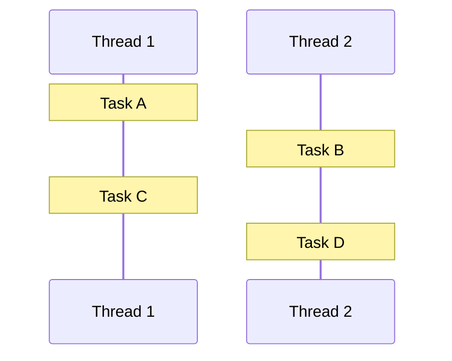
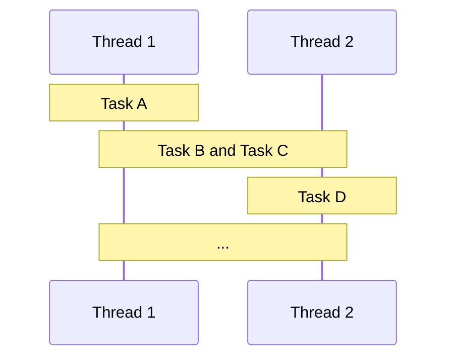
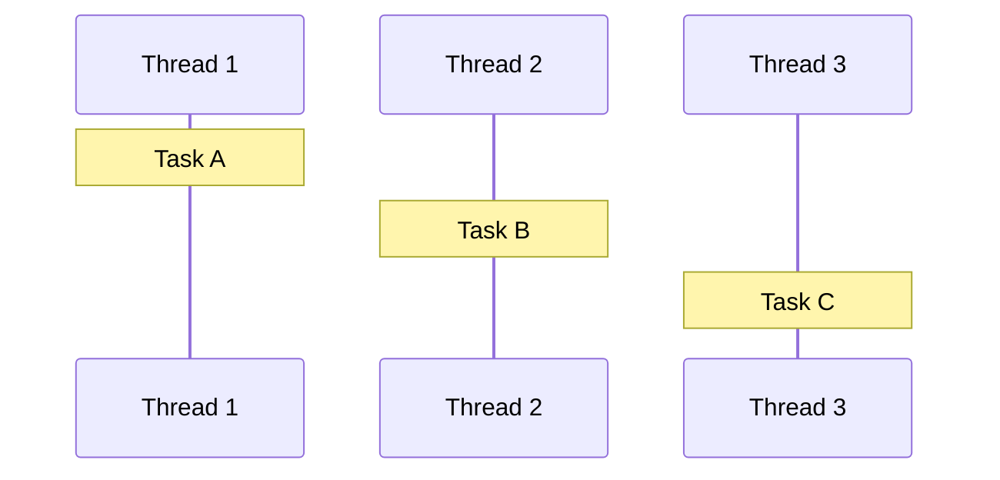
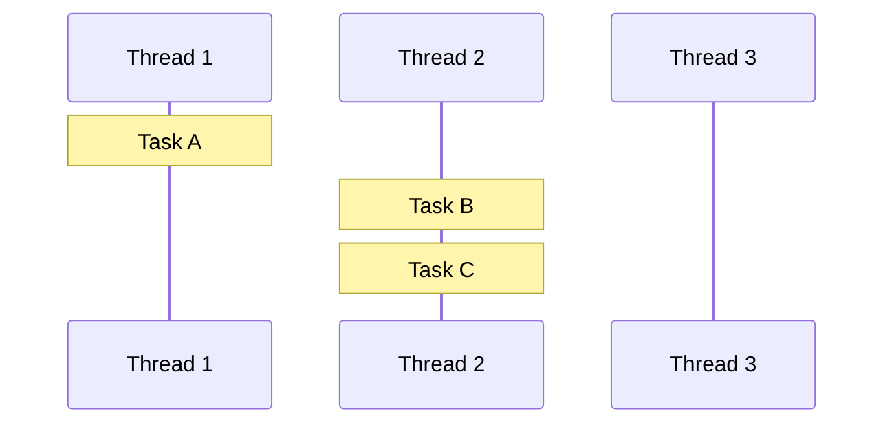
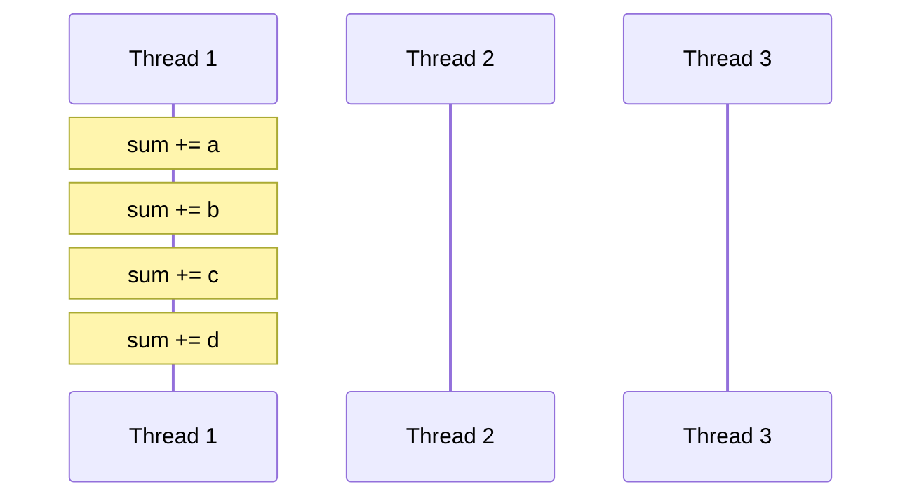
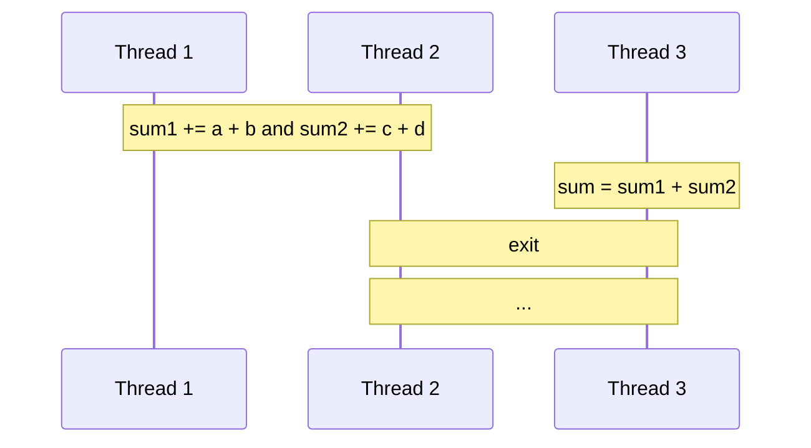
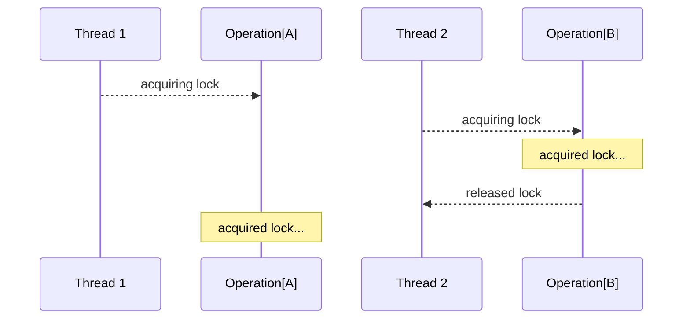

# Asynchornous and multithreaded programming

Intro to asynchornous and multithreaded programming using C++

<div class="pt-12">
    <span @click="$slidev.nav.next" class="py-1 rounded cursor-pointer" hover="bg-white bg-opacity-10">
        Get Started <carbon:arrow-right class="inline" />
    </span>
</div>

---

# Why we have this class?

Let's known what we're talking about

Suppose there is a process, that receiving real time inputs and corresponding to each input it has to produce a certain output.

Now, if the process is not multi-threaded ie if the process does not involve multiple threads, then the whole processing in the process becomes synchronous. This means that the process takes an input processes it and produces an output.

The limitation in the above design is that the process cannot accept an input until its done processing the earlier one and in case processing an input takes longer than expected then accepting further inputs goes on hold.

---

# What is threads?

Introduction to Linux threads concepts

- A thread of execution is often regarded as the smallest unit of processing that a scheduler works on.

- A process can have multiple threads of execution which are executed asynchronously.

- Creating a thread or terminating a thread is done by the operating system, which consumes CPU cycles.

- This asynchronous execution brings in the capability of each thread handling a particular work or service independently. Hence multiple threads running in a process handle their services which overall constitutes the complete capability of the process.

---

# What is synchronous programming?

Let's understand what is synchronous programming

- In synchrony execution model, thread is assigned to one task and starts the execution of its commands.

- When the task is complete, the thread takes the next task and does the same: it executes all its commands one after another to perform one specified task.

- In such a system, a thread cannot leave a task halfway done and go to the next one.

---

# What is asynchronous programming?

Asynchronous is the opposite of synchronous, reprenting the concurrency execution of multiple tasks

- In asynchrony execution model, it refers to the occurrence of events independent of the main program flow.

- When the task is executing, the main thread has non-blocking I/O so that the task can execute simultaneously with other tasks.

- In such a system, a thread can leave a task halfway done and go to the next one.

---

# Understand concurrency and parallelism

Concurrency and parallelism are two different things, but they're both based threads

- Concerrency

  Concurrency is the execution of more than one task is being processed in overlapping time periods. An important detail is that tasks are not necessarily performed at the same time(but it's possible). That is based on the notion of Interruptability — tasks can be divided into smaller and alternating subtasks. In this case, they can be executed simultaneously, but this is not necessary.

- Parallelism

  Parallelism is literally the simultaneous execution of tasks. The very name implies that they are executed in parallel. Parallelism is one of the ways to implement concurrent execution highlighting abstraction of a thread or process. Also for parallelism to be true, there must be at least two computational resources.

---
title: Concurrency and Parallelism
layout: two-cols
---

# Synchrony

Only one task executing allowed at the same time



::right::

# Asynchrony

Multiple tasks executing allowed at the same time



---

# Asynchronous programming example

Let's understand how to write code asynchrony

Here we declare a function to calculate the square number of an integer.

```cpp
auto slow_sqr(const int value) {
    std::this_thread::sleep_for(500ms);
    return value * value;
}
```

Generally, asynchronous functions are more complicated than this, it always called by the network or file system, which always have a long execution time. For the sake of simplicity, the example function is just calculating a square number with a `500ms` delay.

---
title: The slow square execution flow
---

Then, assuming we have 3 tasks to calculate the square of some integer and print them to the console, normally you may write code like this.

```cpp
{
    auto result1 = slow_sqr(2);  // Task 1
    auto result2 = slow_sqr(4);  // Task 2
    auto result3 = slow_sqr(8);  // Task 3
    std::printf("results -> %d, %d, %d\n", result1, result2, result3);
}
```

As you see, this tasks may take more than `1500ms` to execute, because the execution order of them is literally sequential that the next task must wait the task before to execute.

---
title: The asynchronous slow square execution flow
---

Let's write our `slow_sqr` in a asynchronous way, thus the next task do not need to wait the task before to execute.

```cpp
{
    auto result1 = async_sqr_ftr(slow_sqr, 2);  // Task 1
    auto result2 = async_sqr_ftr(slow_sqr, 4);  // Task 2
    auto result3 = async_sqr_ftr(slow_sqr, 8);  // Task 3
    std::printf("results -> %d, %d, %d\n", result1.get(), result2.get(), result3.get());
}
```

The `async_sqr_ftr` function is a wrapper function that returns a future object immediately, which is a container for the result of the asynchronous function, and the `get()` function is used to get the result of the future object when it is ready.

---
title: The asynchronous slow square
---

Let's learn how our `async_sqr_ftr()` function works, as the following code.

```cpp
std::future<int> async_sqr_ftr(const int value) {
    std::promise<int> pms;
    std::future<int> ftr { pms.get_future() };
    std::thread thr([p = std::move(pms), v = value]() mutable {
        p.set_value(slow_sqr(v));
    });
    thr.detach();
    return ftr;
}
```

---
title: The asynchronous slow square
---

The standard library provides us with a way called `std::future`. This future contains an asynchronous operation result, which is generally associated with the corresponding `std::promise`.


```cpp {2,3}
std::future<int> async_sqr_ftr(const int value) {
    std::promise<int> pms;
    std::future<int> ftr { pms.get_future() };
    std::thread thr([p = std::move(pms), v = value]() mutable {
        p.set_value(slow_sqr(v));
    });
    thr.detach();
    return ftr;
}
```

---
title: The asynchronous slow square
---

In order to avoid the caller got blocked, we open a new thread for the calculation. Note here the promise is moved into the new thread instead of being captured by direct reference, otherwise the `pms` will be destroyed after exectution of `return`, due to RAII (Resource Acquisition Is Initialization).

```cpp {4,8}
std::future<int> async_sqr_ftr(const int value) {
    std::promise<int> pms;
    std::future<int> ftr { pms.get_future() };
    std::thread thr([p = std::move(pms), v = value]() mutable {
        p.set_value(slow_sqr(v));
    });
    thr.detach();
    return ftr;
}
```

---
title: The asynchronous slow square
---

After the thread is created, we detach the thread that the thread will run in the background unitl the task inside is finished, and we return the future object so that the caller can continue to do other tasks.

```cpp {7,8}
std::future<int> async_sqr_ftr(const int value) {
    std::promise<int> pms;
    std::future<int> ftr { pms.get_future() };
    std::thread thr([p = std::move(pms), v = value]() mutable {
        p.set_value(slow_sqr(v));
    });
    thr.detach();
    return ftr;
}
```

---
title: The asynchronous slow square
---

After the calculation is completed, the `set_value()` method of promise can be called to set this return value, while the corresponding `future::get()` method can block the current thread until the corresponding promise returns the value.

```cpp {5}
std::future<int> async_sqr_ftr(const int value) {
    std::promise<int> pms;
    std::future<int> ftr { pms.get_future() };
    std::thread thr([p = std::move(pms), v = value]() mutable {
        p.set_value(slow_sqr(v));
    });
    thr.detach();
    return ftr;
}
```

---

# The `std::async`

Asynchronous programming example using `std::async`

Actually, the above code is a tiny part implementation of `std::async`, thus we could use that directly.

```cpp
{
    auto result1 = std::async(slow_sqr, 2);  // Task 1
    auto result2 = std::async(slow_sqr, 4);  // Task 2
    auto result3 = std::async(slow_sqr, 8);  // Task 3
    std::printf("results -> %d, %d, %d\n", result1.get(), result2.get(), result3.get());
}
```

When calling `std::async`, it would return a `std::future`. Then use its method `get()` to get the result of each tasks, the method waits until it has a valid result and retrieves it, if the task already have a one, the `get()` method returns immediately, otherwise they wait until it have a one.

---

# What is `std::async` and how to use it?

It is a function template that accepts callbacks (functions or function objects) as arguments and has the possibility to execute them asynchronously

```cpp
template<class Function, class... Args>
std::future<std::result_of_t<std::decay_t<Function>(std::decay_t<Args>...)>>
async(Function&& f, Args&&... args);

template< class Function, class... Args >
std::future<std::invoke_result_t<std::decay_t<Function>, std::decay_t<Args>...>>
async(std::launch policy, Function&& f, Args&&... args);
```

---
title: The launch policy
---

Let's understand the `std::launch` policy,it has 2 bitmask value, where individual bits control the allowed methods of execution.


| Bitmask                   | Description             |
|---------------------------|-------------------------|
| `std::launch::async`      | asynchronous evaluation |
| `std::launch::deferred`   | lazy evaluation         |

---
title: Understand the launch policy
layout: two-cols
---

# Asynchronous evaluation

Each task will obtain a new thread, and the thread will execute the task (only Linux)



::right::

# Lazy evaluation

The new task will continue in a thread that is already available, otherwise it will create a new thread



---

# When to use lazy evaluation?

Here's an example scenario of using lazy evaluation

As we know, creating and distorying threads is expensive, lasy evaluation means the continuation of the same thread but different tasks, so if the tasks are meant something continuous, we can use lazy evaluation.

For example, calculating the result of $2^{2*2*2}=2^8$:

```cpp
void 🍉 (const int value = 2) {
    auto squared = std::async(std::launch::deferred, slow_sqr, value);
    auto fourth  = std::async(std::launch::deferred, slow_sqr, squared.get());
    auto result  = std::async(std::launch::deferred, slow_sqr, fourth.get());
    std::printf("result -> %d\n", result.get());
}
```
----

# What about the callback function?

How to use the callback functions instead of `std::async`

For this simple lazy evaluation scenario, we can easily infer that all the calculations could be done by call back functions.

```cpp
void 🍉 (const int value = 2) {
    std::promise<void> pms;
    std::future<void> ftr = pms.get_future();
    async_sqr_cbk(value, [p = std::move(pms)](const int squared) mutable {
        async_sqr_cbk(squared, [p = std::move(p)](const int fourth) mutable {
            async_sqr_cbk(fourth, [p = std::move(p)](const int result) mutable {
                std::printf("result -> %d\n", result);
                p.set_value();
            });
        });
    });
    ftr.get();
}
```

---

# The callback function

What is the implementation of `async_sqr_cbk()`?

```cpp
template <std::invocable<int> F>
void async_sqr_cbk(const int value, F&& continuation) {
    std::thread thr([v = value, c = std::forward<F>(continuation)]() mutable {
        c(slow_sqr(v));
    });
    thr.detach();
}
```

As we talked before, lazy evaluation means the continuation of the same thread but different tasks, so if the tasks are meant something continuous, we can use callback function to reconstruct the execution flow of these tasks.

---
title: The implementation of `async_sqr_cbk()`
---

```cpp {3,5,6}
template <std::invocable<int> F>
void async_sqr_cbk(const int value, F&& continuation) {
    std::thread thr([v = value, c = std::forward<F>(continuation)]() mutable {
        c(slow_sqr(v));
    });
    thr.detach();
}
```

Like `async_sqr_ftr()` we talked before, we create a new thread and then detach it, so that calling this function will not block the main thread.

---
title: The implementation of `async_sqr_cbk()`
---

```cpp {4}
template <std::invocable<int> F>
void async_sqr_cbk(const int value, F&& continuation) {
    std::thread thr([v = value, c = std::forward<F>(continuation)]() mutable {
        c(slow_sqr(v));
    });
    thr.detach();
}
```

We calculate inside the new thread, after the calculation is done, we pass the result as a parameter to the continuation of a function named `c`.

---

# The coroutine

C++ 20 introduces coroutine that simplifies the use and implementation of asynchronous algorithms

If we uses coroutine, the code that calculating the result of $2^{2*2*2}=2^8$ will be more readable and easier to maintain:

```cpp
task 🍉 (const int value = 2) {
    auto squared = co_await slow_sqr_coro(value);
    auto fourth  = co_await slow_sqr_coro(squared);
    auto result  = co_await slow_sqr_coro(fourth);
    std::printf("result -> %d\n", result);
}
```

Unlike a normal function, there can be multiple suspension points in a concurrent tasks. The suspended task passes control to the caller, who can then resume the execution of the task again. The resumed task will continue execution from the last suspended position until the next suspension, or the end of the entire task execution.

---

# Coroutine for slow square

Let's see the implementation of `slow_sqr_coro`

```cpp
struct slow_sqr_coro {
    explicit slow_sqr_coro(const int value) : m_value(value) {}
    bool await_ready() const noexcept { return false; }
    void await_suspend(const std::coroutine_handle<> awaiting) {
        async_sqr_cbk(m_value, [this, awaiting](const int result) {
            m_result = result;
            awaiting.resume();
        });
    }
    int await_resume() const noexcept { return m_result; }
    int m_value  { 0 };
    int m_result { 0 };
};
```

We uses a struct named `slow_sqr_coro` to represent the coroutine, the member fuction names represent the rules of coroutine.

---
title: The implementation of `slow_sqr_coro`
---

```cpp {2,11,12}
struct slow_sqr_coro {
    explicit slow_sqr_coro(const int value) : m_value(value) {}
    bool await_ready() const noexcept { return false; }
    void await_suspend(const std::coroutine_handle<> awaiting) {
        async_sqr_cbk(m_value, [this, awaiting](const int result) {
            m_result = result;
            awaiting.resume();
        });
    }
    int await_resume() const noexcept { return m_result; }
    int m_value  { 0 };
    int m_result { 0 };
};
```

Firstly, we need to store the parameters in somewhere, the easiest and most straightforward way to do this is to store it in a member variable while initializing `slow_sqr_coro`, and then we can pass the parameters to the callback functions when the process hangs.

---
title: The implementation of `slow_sqr_coro`
---

```cpp {3}
struct slow_sqr_coro {
    explicit slow_sqr_coro(const int value) : m_value(value) {}
    bool await_ready() const noexcept { return false; }
    void await_suspend(const std::coroutine_handle<> awaiting) {
        async_sqr_cbk(m_value, [this, awaiting](const int result) {
            m_result = result;
            awaiting.resume();
        });
    }
    int await_resume() const noexcept { return m_result; }
    int m_value  { 0 };
    int m_result { 0 };
};
```

Remember what is lazy evaluation? Here we always want the concurrent process to hang directly, because the execution flow is something that meant continuation, so let `await_ready()` return false directly.

---
title: The implementation of `slow_sqr_coro`
---

```cpp {4-9}
struct slow_sqr_coro {
    explicit slow_sqr_coro(const int value) : m_value(value) {}
    bool await_ready() const noexcept { return false; }
    void await_suspend(const std::coroutine_handle<> awaiting) {
        async_sqr_cbk(m_value, [this, awaiting](const int result) {
            m_result = result;
            awaiting.resume();
        });
    }
    int await_resume() const noexcept { return m_result; }
    int m_value  { 0 };
    int m_result { 0 };
};
```

Then we do the calculation in a callback function while the concurrent process is suspended, the callback function `async_sqr_cbk()` takes two parameters, the first one is the value to be calculated, the second one is the continuation function.

---
title: The implementation of `slow_sqr_coro`
---

```cpp {5-8}
struct slow_sqr_coro {
    explicit slow_sqr_coro(const int value) : m_value(value) {}
    bool await_ready() const noexcept { return false; }
    void await_suspend(const std::coroutine_handle<> awaiting) {
        async_sqr_cbk(m_value, [this, awaiting](const int result) {
            m_result = result;
            awaiting.resume();
        });
    }
    int await_resume() const noexcept { return m_result; }
    int m_value  { 0 };
    int m_result { 0 };
};
```

When the last continuation function is called, we store the final result in the member variable `m_result`, and then we resume the awaiting coroutine.

---
title: The implementation of `slow_sqr_coro`
---

```cpp {10}
struct slow_sqr_coro {
    explicit slow_sqr_coro(const int value) : m_value(value) {}
    bool await_ready() const noexcept { return false; }
    void await_suspend(const std::coroutine_handle<> awaiting) {
        async_sqr_cbk(m_value, [this, awaiting](const int result) {
            m_result = result;
            awaiting.resume();
        });
    }
    int await_resume() const noexcept { return m_result; }
    int m_value  { 0 };
    int m_result { 0 };
};
```

When the concurrent process is resumed, we can now return `m_result` as the result of the coroutine.

---

# Parallel alogrithms

Let's learn some parallel algorithms provided by standard library

Assume we have a vector of integers, and we want to calculate the sum of all the elements in the vector.

```cpp
std::vector<int> vec(1e2);
std::iota(vec.begin(), vec.end(), 1);
```

Generally, you may simply calculate the sum of all the elements in the vector like this.

```cpp
auto sum { 0 };
for (const auto& v : vec) {
    sum += v;
}

// or

auto sum = std::accumulate(vec.begin(), vec.end(), int{0});
```

Consider a special scenario, the vector size is very big, calculating in single thread like this is not efficient.

---
title: The `std::reduce()` algorithm
---

`std::reduce` was added in C++17 and looks remarkably similar, we can use it do the same thing as `std::accumulate`:

```cpp
auto sum = std::reduce(vec.begin(), vec.end(), int{0});
```

The reason we talk about `std::reduce` is that it could be a more efficient algorithm than `std::accumulate`, compared in the following code:

```cpp
template<class InputIt, class T, class BinaryOperation>
T accumulate(InputIt first, InputIt last, T init, BinaryOperation op);

template<class ExecutionPolicy, class ForwardIt, class T, class BinaryOp>
T reduce(ExecutionPolicy&& policy, ForwardIt first, ForwardIt last, T init, BinaryOp binary_op);
```

---

# The `ExecutionPolicy`

The execution policy type used as a unique type to disambiguate parallel algorithm overloading

From reference, here're 4 usual execution policy types:

| Policies                    | Description                             |
| --------------------------- | --------------------------------------- |
| `std::execution::seq`       | sequential, not parallelise             |
| `std::execution::par`       | sequential, parallelise                 |
| `std::execution::par_unseq` | unsequential, parallelise and vectorise |
| `std::execution::unseq`     | unsequential, not parallelise           |

*vectorise: requires that the operation can be interleaved*

---
title: The `ExecutionPolicy`
layout: two-cols
---

# `std::execution::seq`

Sequential execution, not parallelise



::right::

# `std::execution::par`

Sequential execution, parallelise



---

# Parallel alogrithms

Let's learn some parallel algorithms provided by standard library

We can now have our final version sum using `std::reduce`:

```cpp
auto sum = std::reduce(std::execution::par_unseq, vec.begin(), vec.end(), int{0});
```

Although the stand library provides many parallel algorithms, not all of them are suitable for our use case, so use them carefully.

*Note: Currently the `std::execution` requires Intel TBB library*

---

# Thread synchronization

Let's talk about the basic thread synchronizations

```cpp
class Counter {
public:
    Counter() = default;
    auto get() const { return m_value; }
    void increment() { ++m_value; }
private:
    unsigned int m_value { 0 };
};

{
    Counter counter;
    auto f = [&] { for (const auto& i : std::views::iota(0, 1e6)) { counter.increment(); } };
    auto thread1 = std::thread(f);
    auto thread2 = std::thread(f);
    thread1.join();
    thread2.join();
    std::printf("counter -> %d\n", counter.get());
}
```

Consider what happens when we run the above code.

---
title: Thread synchronization
---

```cpp {1-8,11}
class Counter {
public:
    Counter() = default;
    auto get() const { return m_value; }
    void increment() { ++m_value; }
private:
    unsigned int m_value { 0 };
};

{
    Counter counter;
    auto f = [&] { for (const auto& i : std::views::iota(0, 1e6)) { counter.increment(); } };
    auto thread1 = std::thread(f);
    auto thread2 = std::thread(f);
    thread1.join();
    thread2.join();
    std::printf("counter -> %d\n", counter.get());
}
```

We created a `Counter` abstraction class and counter object, the class has two methods: `get()` and `increment()`.

---
title: Thread synchronization
---

```cpp {12-14}
class Counter {
public:
    Counter() = default;
    auto get() const { return m_value; }
    void increment() { ++m_value; }
private:
    unsigned int m_value { 0 };
};

{
    Counter counter;
    auto f = [&] { for (const auto& i : std::views::iota(0, 1e6)) { counter.increment(); } };
    auto thread1 = std::thread(f);
    auto thread2 = std::thread(f);
    thread1.join();
    thread2.join();
    std::printf("counter -> %d\n", counter.get());
}
```

Then two threads are created, and each thread is running in a loop, each calling `increment()` method for $1*10^6$ times.

---
title: Thread synchronization
---

```cpp {15--17}
class Counter {
public:
    Counter() = default;
    auto get() const { return m_value; }
    void increment() { ++m_value; }
private:
    unsigned int m_value { 0 };
};

{
    Counter counter;
    auto f = [&] { for (const auto& i : std::views::iota(0, 1e6)) { counter.increment(); } };
    auto thread1 = std::thread(f);
    auto thread2 = std::thread(f);
    thread1.join();
    thread2.join();
    std::printf("counter -> %d\n", counter.get());
}
```

Last we print the counter after two threads are joined.

---
title: The problem
---

```cpp
{
    Counter counter;
    auto f = [&] { for (const auto& i : std::views::iota(0, 1e6)) { counter.increment(); } };
    auto thread1 = std::thread(f);
    auto thread2 = std::thread(f);
    thread1.join();
    thread2.join();
    std::printf("counter -> %d\n", counter.get());
}
```

What will the program print?

- `counter -> N`, N < $2*1*10^6$

- `counter -> N`, N = $2*1*10^6$

---

# Why this happens?

Thread safety is not guaranteed

The thread safety is not guaranteed because the self-incrementing counter is not atomic, which means that the counter's incremention by multiple threads could be happen at the same time.

Atomic increment means that all the instruction operations cannot be interrupted, because the self-incrementing operation may have many instructions after compile. If the interruption happens and the `m_value` changed by other threads, this will cause error.

```asm
Counter::increment():
        push    rbp
        mov     rbp, rsp
        mov     QWORD PTR [rbp-8], rdi
        mov     rax, QWORD PTR [rbp-8]
        mov     eax, DWORD PTR [rax]
        lea     edx, [rax+1]
        mov     rax, QWORD PTR [rbp-8]
        mov     DWORD PTR [rax], edx
        nop
        pop     rbp
        ret
```

---

# The `std::mutex`

The basic thread synchronization method `std::mutex`

The mutex class is a synchronization primitive that can be used to protect shared data from being simultaneously accessed by multiple threads.

| Method                 | Description                                                  |
| ---------------------- | ------------------------------------------------------------ |
| `std::mutex::lock`     | locks the mutex, blocks if the mutex is not available        |
| `std::mutex::try_lock` | tries to lock the mutex, returns if the mutex is not available |
| `std::mutex::unlock`   | unlocks the mutex                                            |

---
title: The `std::mutex`
---

```cpp {6-8,11}
class Counter {
public:
​    Counter() = default;
​    auto get() const { return m_value; }
​    void increment() {
​        m_mutex.lock();
​        ++m_value;
​        m_mutex.unlock();
​    }
private:
​    mutable std::mutex m_mutex;
​    unsigned int m_value { 0 };

};
```

We defined a mutex `m` to protect the `Counter`, the mutex is locked while doing the non-const operation `increment()` and unlocked after the operation is done.

But there's still a problem, through the `get()` method is const, but we're not supposed to get the value while the `m_value` is incrementing, if we also have a lock here, how to unlock the mutex after `return`?

---
title: The `std::lock_guard`
---

```cpp {4-11}
class Counter {
public:
​    Counter() = default;
​    auto get() const {
        std::lock_guard lk(m_mutex);
        return m_value;
    }
​    void increment() {
        std::lock_guard lk(m_mutex);
​        ++m_value;
​    }
private:
​    mutable std::mutex m_mutex;
​    unsigned int m_value { 0 };
};
```

Or we can simply use the `std::lock_guard` which is a RAII class that locks the mutex for the duration of the guard's lifetime.

---
title: The `std::shared_mutex`
---

```cpp {5,9,13}
class Counter {
public:
    Counter() = default;
    auto get() const {
        std::shared_lock lk(m_mutex);
        return m_value;
    }
​    void increment() {
​        std::unique_lock lk(m_mutex);
​        ++m_value;
​    }
private:
​    mutable std::shared_mutex m_mutex;
​    unsigned int m_value { 0 };
};
```

Consider that the const `get()` method is really need to be always atomic? Obviously not, it only needs to be atomic when the `m_value` is incrementing, so we can use `std::shared_mutex` as a more efficient way to synchronize.

With a `std::shared_lock`, multiple threads can get the counter's value at the same time, similarly `std::unique_lock` can suppose that there is only one thread/writer can increment/write the counter's value at the same time.

---

# The thread synchronize library

Here we list some basic thread synchronization methods, not include in the examples

| Methods                   | Description                                                  |
| ------------------------- | ------------------------------------------------------------ |
| `std::timed_mutex`        | a mutex offers exclusive, non-recursive ownership semantics, provides the ability to attempt to claim ownership with a timeout |
| `std::scoped_lock`        | a deadlock-avoiding RAII wrapper for multiple mutexes        |
| `std::condition_variable` | a synchronization primitive that can be used to block a thread, or multiple threads at the same time, until another thread both modifies a shared variable |
| `std::counting_semaphore` | a lightweight synchronization primitive that can control access to a shared resource |
| `std::latch`              | a single-use counter blocker on the latch until the counter is decremented to zero |
| `std::barrier`            | a reusable counter blocker on the latch until the counter is decremented to zero |

---

# The `std::atomic`

`std::atomic` template defines an atomic type with atomic operations

Say goodbye to synchronization, we can use `std::atomic` to implement the counter:

```cpp
class Counter {
public:
    Counter() = default;
    auto get() const { return m_value.load(); }
    void increment() { ++m_value; }
private:
    std::atomic<unsigned int> m_value { 0 };
};
```

For this scenario, we can use `std::atomic` to implement the counter, but it not means all the types is atomic, it only supports a few types and you can check the atomicability of a type by `std::atomic<T>::is_always_lock_free()`.

---

# The `std::atomic` is not only atomic

`std::atomic` is more powerful than you think

```cpp
class spin_mutex {
public:
    void lock() noexcept const {
        while (m_flag.test_and_set(std::memory_order::acquire)) {
            m_flag.wait(true, std::memory_order::relaxed);
        }
    }
    void unlock() noexcept const {
        m_flag.clear(std::memory_order::release);
        m_flag.notify_one();
    }
private:
    alignas(std::hardware_constructive_interference_size) mutable std::atomic_flag m_flag;
};
```

Although `std::atomic` is only atomic, it can be used to implement the spin lock, compared with the `std::mutex`, atomic uses cpu instructions directly instead of OS level call, which is more efficient and super fast.

---
title: The `spin_mutex`
---

```cpp {13}
class spin_mutex {
public:
    void lock() noexcept const {
        while (m_flag.test_and_set(std::memory_order::acquire)) {
            m_flag.wait(true, std::memory_order::relaxed);
        }
    }
    void unlock() noexcept const {
        m_flag.clear(std::memory_order::release);
        m_flag.notify_one();
    }
private:
    alignas(std::hardware_destructive_interference_size) mutable std::atomic_flag m_flag;
};
```

We declare `m_flag` as a `std::atomic_flag`, it is an atomic boolean type which uses whole single cache line, constructed by `alignas` with minimum offset `std::hardware_destructive_interference_size` to avoid false sharing.

---
title: The `spin_mutex`
---

```cpp {3-4,6-7}
class spin_mutex {
public:
    void lock() noexcept const {
        while (m_flag.test_and_set(std::memory_order::acquire)) {
            m_flag.wait(true, std::memory_order::relaxed);
        }
    }
    void unlock() noexcept const {
        m_flag.clear(std::memory_order::release);
        m_flag.notify_one();
    }
private:
    alignas(std::hardware_destructive_interference_size) mutable std::atomic_flag m_flag;
};
```

We use the `test_and_set()` method atomically sets the flag to `true` and obtains its previous value, the parameter `std::memory_order::acquire` is used to ensure that compiler would not reorder other reads or writes before the `test_and_set()` operation and the operation is turly visible to other threads.

---
title: The `spin_mutex`
---

```cpp {5}
class spin_mutex {
public:
    void lock() noexcept const {
        while (m_flag.test_and_set(std::memory_order::acquire)) {
            m_flag.wait(true, std::memory_order::relaxed);
        }
    }
    void unlock() noexcept const {
        m_flag.clear(std::memory_order::release);
        m_flag.notify_one();
    }
private:
    alignas(std::hardware_destructive_interference_size) mutable std::atomic_flag m_flag;
};
```

If its previous value is `true`, we'll get into this loop. Here use the `wait()` method which blocks the thread until notified and the atomic value changes, and we'll wait until the flag is set to `false`, the first parameter is the privious value, the second parameter `std::memory_order::relaxed` means that there are no synchronization or ordering constraints imposed on other reads or writes, only this operation's atomicity is guaranteed.

---
title: The `spin_mutex`
---

```cpp {8-11}
class spin_mutex {
public:
    void lock() noexcept const {
        while (m_flag.test_and_set(std::memory_order::acquire)) {
            m_flag.wait(true, std::memory_order::relaxed);
        }
    }
    void unlock() noexcept const {
        m_flag.clear(std::memory_order::release);
        m_flag.notify_one();
    }
private:
    alignas(std::hardware_destructive_interference_size) mutable std::atomic_flag m_flag;
};
```

For the unlock operation, we use the `clear()` method to set the flag to `false` and notify one thread, the parameter `std::memory_order::release` is used to ensure that compiler would not reorder other reads or writes after the `clear()` operation and the operation is turly visible to other threads.

---

# The `spin_mutex` is unfair

Although we have implemented the spin lock, the spin lock is only suitable for non-ordered scnearios



---

# Why the order is important?

Let's think about why the order is required

Consider the a scenario that you're using this mutex to protect a queue which sensitive to the order of the elements in the queue.

```cpp
{  // Thread 1
    std::lock_guard lk(spin_mutex);
    frame_queue.push(image[1]);  // Operation 1
}
{  // Thread 2
    std::lock_guard lk(spin_mutex);
    frame_queue.push(image[2]);  // Operation 2
}
```

If you're pushing the images to a frame queue to represent a video stream, due to some reasons (the threads may atomaticly attach to a processor by system, each processor may have different speed), Operation 1 happens before Operation 2, but Thread 1 acquires the lock longer than Thread 2 that lead to Operation 2 finished before Operation 1, which leads to the video stream is not in the correct order.

---

# The `ticket_mutex`

The ticket mutex preserves the order of operations

```cpp
class ticket_mutex {
public:
    void lock() noexcept const {
        auto const ticket { m_out.fetch_add(1, std::memory_order::acquire) };
        while (true) {
            auto const now { m_rec.load(std::memory_order::acquire) };
            if (now == ticket) { return; }
            m_rec.wait(now, std::memory_order::relaxed);
        }
    }
    void unlock() noexcept const {
        m_rec.fetch_add(1, std::memory_order::release);
        m_rec.notify_all();
    }
private:
    alignas(std::hardware_destructive_interference_size) mutable std::atomic<std::size_t> m_out;
    alignas(std::hardware_destructive_interference_size) mutable std::atomic<std::size_t> m_rec;
};
```

---
title: The `ticket_mutex`
---

```cpp {16-17}
class ticket_mutex {
public:
    void lock() noexcept const {
        auto const ticket { m_out.fetch_add(1, std::memory_order::acquire) };
        while (true) {
            auto const now { m_rec.load(std::memory_order::acquire) };
            if (now == ticket) { return; }
            m_rec.wait(now, std::memory_order::relaxed);
        }
    }
    void unlock() noexcept const {
        m_rec.fetch_add(1, std::memory_order::release);
        m_rec.notify_all();
    }
private:
    alignas(std::hardware_destructive_interference_size) mutable std::atomic<std::size_t> m_out;
    alignas(std::hardware_destructive_interference_size) mutable std::atomic<std::size_t> m_rec;
};
```

Here we declare two atomic variables `m_out` and `m_rec` in two different cache lines, the `m_out` is used to store the ticket number the customer recieve, `m_rec` is used to store the ticket number the customer return.

---
title: The `ticket_mutex`
---

```cpp {3-4,10}
class ticket_mutex {
public:
    void lock() noexcept const {
        auto const ticket { m_out.fetch_add(1, std::memory_order::acquire) };
        while (true) {
            auto const now { m_rec.load(std::memory_order::acquire) };
            if (now == ticket) { return; }
            m_rec.wait(now, std::memory_order::relaxed);
        }
    }
    void unlock() noexcept const {
        m_rec.fetch_add(1, std::memory_order::release);
        m_rec.notify_all();
    }
private:
    alignas(std::hardware_destructive_interference_size) mutable std::atomic<std::size_t> m_out;
    alignas(std::hardware_destructive_interference_size) mutable std::atomic<std::size_t> m_rec;
};
```

Once `lock()` operation is acquired, we do a increment to `m_out`.

---
title: The `ticket_mutex`
---

```cpp {5-7,9}
class ticket_mutex {
public:
    void lock() noexcept const {
        auto const ticket { m_out.fetch_add(1, std::memory_order::acquire) };
        while (true) {
            auto const now { m_rec.load(std::memory_order::acquire) };
            if (now == ticket) { return; }
            m_rec.wait(now, std::memory_order::relaxed);
        }
    }
    void unlock() noexcept const {
        m_rec.fetch_add(1, std::memory_order::release);
        m_rec.notify_all();
    }
private:
    alignas(std::hardware_destructive_interference_size) mutable std::atomic<std::size_t> m_out;
    alignas(std::hardware_destructive_interference_size) mutable std::atomic<std::size_t> m_rec;
};
```

If the current `m_rec` equals previous `m_out`, we return immediately.

---
title: The `ticket_mutex`
---

```cpp {8}
class ticket_mutex {
public:
    void lock() noexcept const {
        auto const ticket { m_out.fetch_add(1, std::memory_order::acquire) };
        while (true) {
            auto const now { m_rec.load(std::memory_order::acquire) };
            if (now == ticket) { return; }
            m_rec.wait(now, std::memory_order::relaxed);
        }
    }
    void unlock() noexcept const {
        m_rec.fetch_add(1, std::memory_order::release);
        m_rec.notify_all();
    }
private:
    alignas(std::hardware_destructive_interference_size) mutable std::atomic<std::size_t> m_out;
    alignas(std::hardware_destructive_interference_size) mutable std::atomic<std::size_t> m_rec;
};
```

If the current `m_rec` not equals previous `m_out`, we block the thread and wait for the `m_rec` equals previous `m_out`.

---
title: The `ticket_mutex`
---

```cpp {11-14}
class ticket_mutex {
public:
    void lock() noexcept const {
        auto const ticket { m_out.fetch_add(1, std::memory_order::acquire) };
        while (true) {
            auto const now { m_rec.load(std::memory_order::acquire) };
            if (now == ticket) { return; }
            m_rec.wait(now, std::memory_order::relaxed);
        }
    }
    void unlock() noexcept const {
        m_rec.fetch_add(1, std::memory_order::release);
        m_rec.notify_all();
    }
private:
    alignas(std::hardware_destructive_interference_size) mutable std::atomic<std::size_t> m_out;
    alignas(std::hardware_destructive_interference_size) mutable std::atomic<std::size_t> m_rec;
};
```

Once `unlock()` operation is acquired, we do a increment to `m_rec` as the customer returned the ticket, and notify all the waiting threads.

---

# The conclusion

Let's recall what we have learned in this class

We have learned:

- The concept of asynchronous and multithreaded programming
- The concept of concurrency and parallelism and write concurrent programs
- The basic parallel alogrithms and the execution policy
- The thread synchronization methods and atomic mutexes

We have not talked:

- Instrution level parallelism SIMD
- Design concurrent data structures
- Detailed implementation of mentioned alogrithms
- The future C++ 23 execution model

---
layout: center
class: 'text-center pb-5 :'
---

# Thank You!
